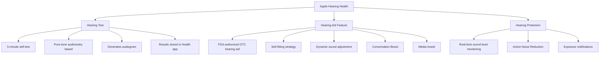
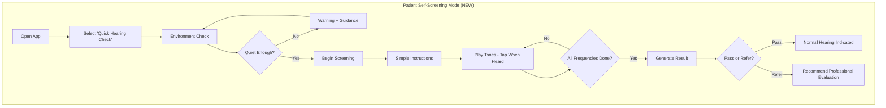
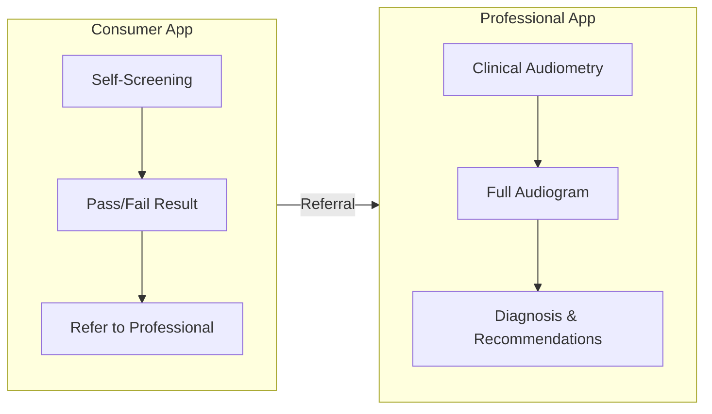
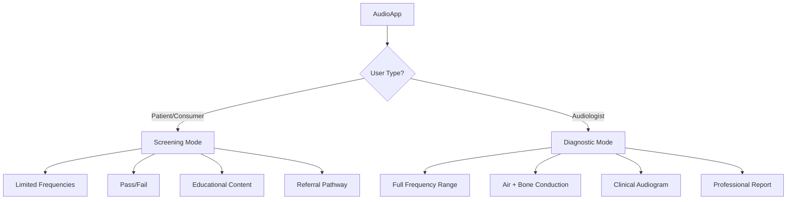

# Apple AirPods Pro 2 Hearing Features Analysis

**Date:** January 15, 2026  
**Purpose:** Analysis of Apple's FDA-approved hearing features and additional requirements needed for AudioApp to achieve similar capabilities

---

## 1. Overview of Apple's Hearing Health Features (iOS 18.1+)

Apple released groundbreaking hearing health features for AirPods Pro 2 in October 2024 with iOS 18.1:

### 1.1 Three Core Features



### 1.2 Key Features Breakdown

| Feature | Description | Technical Details |
|---------|-------------|-------------------|
| **Hearing Test** | Self-administered pure-tone audiometry | 5 minutes, 500Hz-4kHz, clinically validated |
| **Hearing Aid** | OTC amplification for mild-moderate loss | Personalized to hearing profile, real-time adjustment |
| **Hearing Protection** | Monitors and limits exposure | Active noise reduction, dB level tracking |
| **Conversation Boost** | Enhances face-to-face speech | Directional beamforming microphones |
| **Media Assist** | Improves music, calls, videos | Frequency-specific amplification |

---

## 2. FDA Regulatory Path Apple Used

> [!IMPORTANT]
> Apple obtained the **first-ever FDA authorization for an OTC hearing aid SOFTWARE device** in September 2024.

### 2.1 Regulatory Pathway: De Novo Classification

| Aspect | Details |
|--------|---------|
| **Submission Type** | De Novo Premarket Review |
| **Classification** | Class II Medical Device |
| **Device Type** | Software as Medical Device (SaMD) |
| **Intended Population** | Adults 18+ with mild to moderate hearing loss |
| **Regulatory Significance** | First OTC hearing aid software device |

### 2.2 Key Compliance Requirements Met

1. **Clinical Validation**
   - Analyzed 150,000+ real-world audiograms
   - Millions of simulations performed
   - Clinical study supporting FDA listing
   - Global medical device authority authorizations

2. **Self-Fitting Strategy**
   - User can adjust volume, tone, balance
   - No professional assistance required
   - Personalization based on hearing test results

3. **Safety Measures**
   - Clear labeling about intended use
   - Advises professional consultation
   - Age restriction (18+)
   - Output limiting for hearing protection

---

## 3. Screening vs. Diagnostic: Critical Distinction

Your desire to offer **both screening AND diagnostics** in one app has significant implications:

### 3.1 Comparison Table

| Aspect | Screening | Diagnostic |
|--------|-----------|------------|
| **Purpose** | Identify potential hearing loss | Determine type, degree, cause of loss |
| **Result** | Pass/Fail (refer for testing) | Complete audiogram with interpretation |
| **Duration** | 1-5 minutes | 15-45 minutes |
| **Environment** | Can be non-clinical | Requires controlled environment |
| **Administered By** | Self or non-specialist | Audiologist or trained professional |
| **Tests Included** | Pure-tone air conduction only | Air + bone conduction, speech, tympanometry |
| **Regulatory Status** | Lower risk (enforcement discretion possible) | Higher risk (Class II device) |
| **Claims Allowed** | "Hearing check" / "Screening" | "Diagnostic audiometry" / "Clinical" |

### 3.2 What Apple Did

Apple positioned their hearing test as a **SCREENING** tool, not diagnostic:
- "Identify hearing ability at various frequencies"
- "Not intended to replace professional evaluation"
- "Consult a medical professional for advice"
- Only tests air conduction at speech frequencies (500Hz, 1kHz, 2kHz, 4kHz)

### 3.3 Your App's Current Position

Based on your techspec, AudioApp is positioned as a **DIAGNOSTIC** tool:
- Full pure-tone audiometry (250Hz - 8000Hz)
- Air AND bone conduction testing
- Aimed at clinical use by audiologists
- Generates clinical-grade audiograms

---

## 4. Additional Features Needed for Combined Screening + Diagnostic App

To match Apple's capabilities AND maintain diagnostic functionality:

### 4.1 NEW: Patient Self-Screening Mode



**Requirements:**
- [ ] Simplified UI for non-clinical users
- [ ] Louder initial tones (less precise thresholds)
- [ ] Limited frequency range (speech frequencies only)
- [ ] Binary pass/fail outcome
- [ ] Clear disclaimers throughout
- [ ] Ambient noise gating (don't test in noisy environments)

### 4.2 NEW: Hearing Aid / Sound Enhancement Mode

Apple's key differentiator is the hearing AID functionality:

| Feature | Implementation Requirement |
|---------|---------------------------|
| **Real-time Audio Processing** | Low-latency audio pipeline (<50ms) |
| **Frequency-specific Amplification** | Based on audiogram profile |
| **Bluetooth Audio Routing** | Support for hearing devices |
| **Output Limiting** | Maximum SPL limits (120dB) |
| **Directional Enhancement** | Beamforming microphone support |
| **Personalization Profiles** | Store multiple hearing profiles |

> [!CAUTION]
> Adding hearing aid functionality transforms the app from an assessment tool into a **therapeutic device**, significantly increasing FDA regulatory requirements.

### 4.3 NEW: Hearing Protection Features

| Feature | Description |
|---------|-------------|
| **Live dB Monitoring** | Display current environmental sound level |
| **Exposure Tracking** | Track cumulative daily exposure |
| **Alerts** | Notify when approaching safe limits (85dB/8hr) |
| **Statistics** | Weekly/monthly exposure reports |
| **Integration** | Health app sync (Apple Health, Google Fit) |

### 4.4 Integration Requirements for Bluetooth Hearing Devices

| Requirement | iOS | Android |
|-------------|-----|---------|
| **Classic Bluetooth Audio** | Supported | Supported |
| **Bluetooth LE Audio** | iOS 17+ | Android 13+ |
| **Made for iPhone (MFi)** | Required for hearing aids | N/A |
| **ASHA Protocol** | N/A | Required for hearing aids |
| **Audio Routing** | Core Audio / AVFoundation | AudioManager / AudioTrack |

---

## 5. Updated Implementation Priority

Based on Apple's approach, here are recommended additions:

### Phase 1: Foundation (Required for Screening)
| Priority | Feature | Effort | Purpose |
|----------|---------|--------|---------|
| **P0** | Patient-facing self-screening UI | High | Enable consumer use |
| **P0** | Robust ambient noise detection | Medium | Ensure test validity |
| **P0** | Clear disclaimers & guidance | Low | Regulatory compliance |
| **P0** | Simple pass/fail result | Low | Consumer understanding |
| **P1** | Health app integration (Apple Health) | Medium | Data portability |
| **P1** | Hearing protection monitoring | Medium | Value-add feature |

### Phase 2: Enhanced Diagnostics (Required for Clinical Use)
| Priority | Feature | Effort | Purpose |
|----------|---------|--------|---------|
| **P0** | Professional mode toggle | Low | Separate clinical from consumer |
| **P0** | Audiologist verification workflow | Medium | Ensure clinical oversight |
| **P1** | Comprehensive bone conduction | High (requires hardware) | Diagnostic completeness |
| **P1** | Speech audiometry | High | Diagnostic completeness |
| **P1** | Tympanometry integration | Very High | Middle ear assessment |

### Phase 3: Hearing Aid Features (Therapeutic - High Regulatory Burden)
| Priority | Feature | Effort | Regulatory Impact |
|----------|---------|--------|-------------------|
| **P2** | Real-time amplification | Very High | Requires FDA OTC hearing aid clearance |
| **P2** | Personalized sound profiles | High | Part of OTC hearing aid device |
| **P2** | Conversation boost | Very High | Requires advanced audio processing |
| **P3** | Hearing device pairing | Very High | MFi/ASHA certification |

---

## 6. Regulatory Strategy Recommendation

### Option A: Screening-Only Consumer App + Separate Professional App



**Pros:**
- Lower regulatory burden for consumer app
- Clear separation of intended use
- Faster time to market

**Cons:**
- Two apps to maintain
- Fragmented user experience

### Option B: Unified App with Role-Based Access



**Pros:**
- Unified experience
- Data sharing between modes
- Single codebase

**Cons:**
- Higher regulatory complexity
- Both claims must be validated

### Recommendation

> [!TIP]
> **Recommended approach: Option B (Unified App with Role-Based Access)** with clear mode separation and distinct regulatory positioning for each mode.

---

## 7. Competitive Comparison: Apple vs. Your App

| Feature | Apple AirPods Pro 2 | Current AudioApp | Proposed AudioApp |
|---------|---------------------|------------------|-------------------|
| **Hearing Screening** | ✅ Self-test | ❌ None | ✅ Add self-test |
| **Diagnostic Audiometry** | ❌ Limited | ✅ Full | ✅ Maintain |
| **Bone Conduction** | ❌ None | ✅ Yes | ✅ Maintain |
| **Hearing Aid** | ✅ FDA-cleared | ❌ None | ⚠️ Future (high effort) |
| **Hearing Protection** | ✅ Active | ⚠️ Monitoring only | ✅ Enhance |
| **Professional Use** | ❌ Consumer only | ✅ Primary focus | ✅ Maintain + add |
| **Hardware Requirement** | AirPods Pro 2 | Any calibrated headphones | Any calibrated headphones |
| **Target Audience** | General consumers | Audiologists | Both + tele-audiology |

---

## 8. Technical Requirements Summary

### 8.1 Must-Have for Screening Mode

```dart
// New modules needed for screening functionality

class ScreeningModule {
  // Simplified test configuration
  final List<int> screeningFrequencies = [500, 1000, 2000, 4000]; // Hz
  final int screeningThreshold = 25; // dB HL (pass/fail cutoff)
  final Duration maxTestDuration = Duration(minutes: 5);
  
  // Ambient noise requirements
  final double maxAmbientNoise = 40; // dB SPL
  final bool requiresCalibratedHeadphones = false; // Consumer-grade OK
  
  // Result types
  enum ScreeningResult { pass, refer, incomplete }
}

class EnvironmentMonitor {
  // Real-time ambient noise monitoring
  Stream<double> get ambientNoiseLevel;
  
  // Check if environment suitable for testing
  Future<bool> isEnvironmentSuitable();
  
  // Warn user about noise
  void showNoiseWarning();
}
```

### 8.2 Should-Have for Hearing Protection

```dart
class HearingProtection {
  // Real-time exposure tracking
  double currentExposureDb;
  Duration todayExposure;
  double dailyDose; // Percentage of safe limit
  
  // Notifications
  void scheduleExposureAlert(double thresholdPercent);
  
  // Health app integration
  Future<void> syncToHealthKit();
  Future<void> syncToGoogleFit();
}
```

### 8.3 Future: Hearing Aid Features (Phase 3+)

```dart
// This requires significant audio processing expertise
// and FDA OTC Hearing Aid clearance

class HearingAidProcessor {
  // Real-time audio processing (requires <50ms latency)
  void processAudio(AudioBuffer input, AudioBuffer output);
  
  // Personalization based on audiogram
  void applyHearingProfile(HearingProfile profile);
  
  // Feature modes
  enum HearingAidMode { standard, conversation, music, phone }
  void setMode(HearingAidMode mode);
}
```

---

## 9. Summary: What Needs to Be Added

Based on this analysis, here's the comprehensive list of additions needed:

### Immediate (Screening Feature)
1. ✅ **Patient self-screening mode** - Simplified 5-minute hearing check
2. ✅ **Robust ambient noise detection** - Gate testing on noise level
3. ✅ **Pass/fail result interface** - Clear, non-clinical presentation
4. ✅ **Educational content** - What results mean, when to see professional
5. ✅ **Referral pathway** - Connect to audiologist network or appointment

### Short-term (Enhanced Platform)
6. ✅ **Apple Health integration** - Sync audiograms to Health app
7. ✅ **Google Fit integration** - Android equivalent
8. ✅ **Hearing protection dashboard** - Exposure tracking
9. ✅ **Sound level meter** - Real-time dB monitoring
10. ✅ **Daily/weekly exposure reports** - Trend visualization

### Medium-term (Advanced Features)
11. ⚠️ **Tele-audiology module** - Remote testing with audiologist oversight
12. ⚠️ **Follow-up tracking** - Longitudinal hearing monitoring
13. ⚠️ **Personalized recommendations** - AI-based insights

### Long-term (Hearing Aid Features - High Regulatory Burden)
14. 🔴 **Real-time amplification** - Requires FDA OTC clearance
15. 🔴 **Bluetooth hearing device integration** - MFi/ASHA certification
16. 🔴 **Conversation boost** - Advanced audio processing

---

## 10. Next Steps

1. **Review and decide** on screening vs. combined approach
2. **Consult regulatory expert** on FDA pathway for combined device
3. **Design self-screening UI** based on Apple's user experience patterns
4. **Implement ambient noise gating** as foundation feature
5. **Create implementation plan** for phased rollout
