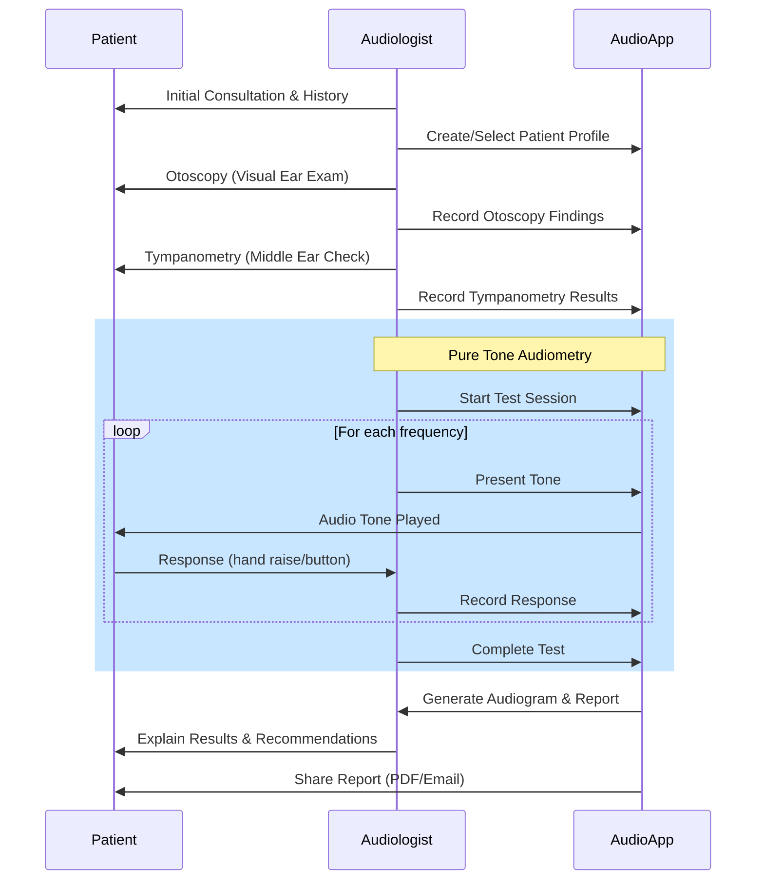
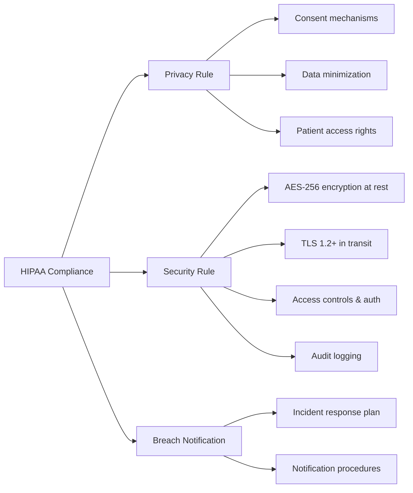
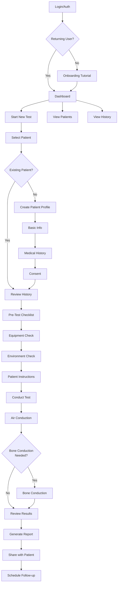
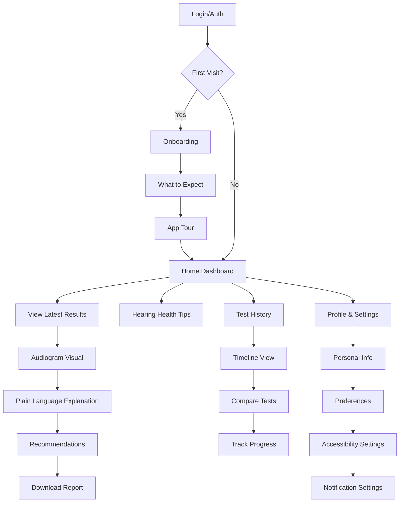

# Audiology Healthcare Application UX/UI Research Report

**Date:** January 15, 2026  
**Application:** AudioApp - Professional Audiometry Mobile Application  
**Purpose:** Comprehensive research on healthcare UX, accessibility, medical considerations, and best practices for audiology applications

---

## Executive Summary

This research document consolidates findings from healthcare UX best practices, accessibility guidelines, audiology-specific considerations, regulatory requirements, and patient-centered design principles. The goal is to identify improvements for the AudioApp to ensure it meets the needs of **audiologists** (primary users), **patients** (including those with hearing impairment and other disabilities), and **healthcare compliance requirements**.

---

## 1. Healthcare UX Design Best Practices

### 1.1 Core Principles for Medical Applications

Healthcare apps operate in high-stakes environments where design decisions directly impact patient outcomes. Key principles include:

| Principle | Description | Implementation |
|-----------|-------------|----------------|
| **Clean & Simple Interfaces** | Avoid clutter, excessive graphics, or overwhelming information | Minimalist design, prioritize essential features |
| **Data Clarity & Legibility** | Medical data is complex and sensitive | Clear typography, appropriate sizing, color-coded charts |
| **Clear Navigation Flows** | Users should never feel lost | Visible navigation, logical grouping, consistent patterns |
| **Mobile-First Optimization** | Many users access apps on smartphones | Responsive layouts, touch-friendly elements |
| **Role-Specific Experiences** | Audiologists vs. patients have different needs | Tailored layouts, actions, and content for each role |
| **Calm Visual Language** | Healthcare situations are stressful | Appropriate whitespace, calming colors, visual hierarchy |
| **Feedback & Responsiveness** | Instant visual feedback on actions | Loading spinners, confirmation messages, haptic feedback |
| **Error Prevention & Recovery** | Prevent mistakes, provide clear recovery paths | Validation messages, undo functionality, confirmations |

### 1.2 Specific Improvements for AudioApp

> [!IMPORTANT]
> Based on the current implementation analysis, the following areas need attention:

1. **Information Hierarchy**: The current screens mix too many concerns. Separate:
   - Testing interface (audiologist workflow)
   - Results viewing (shared by both roles)
   - Patient management (audiologist only)
   - Personal health dashboard (patient view)

2. **Visual Design Refinements**:
   - Increase whitespace between sections
   - Use consistent card styling throughout
   - Implement a more calming color palette (current gradients may be too vibrant for clinical settings)

3. **Feedback Mechanisms**:
   - Add haptic feedback for tone presentation
   - Provide visual confirmation for patient responses
   - Show clear progress indicators during tests

---

## 2. Accessibility Standards (WCAG 2.2)

### 2.1 Four Core WCAG Principles

The Web Content Accessibility Guidelines (WCAG) 2.2 are structured around four principles critical for healthcare apps:

```mermaid
graph TD
    A[WCAG 2.2 Principles] --> B[Perceivable]
    A --> C[Operable]
    A --> D[Understandable]
    A --> E[Robust]
    
    B --> B1[Text Alternatives for non-text content]
    B --> B2[Captions for audio/video]
    B --> B3[4.5:1 contrast ratio for text]
    B --> B4[Resizable text without loss]
    
    C --> C1[Keyboard navigation support]
    C --> C2[Sufficient time for tasks]
    C --> C3[24x24 CSS pixel touch targets]
    C --> C4[Focus not obscured by headers]
    
    D --> D1[Clear, readable language]
    D --> D2[Consistent navigation patterns]
    D --> D3[Input assistance and validation]
    D --> D4[Consistent help documentation]
    
    E --> E1[Screen reader compatibility]
    E --> E2[Semantic HTML structure]
    E --> E3[Assistive technology support]
```

### 2.2 Critical Accessibility Requirements for AudioApp

#### Visual Accessibility
| Requirement | Standard | Current Status | Action Needed |
|-------------|----------|----------------|---------------|
| Text Contrast | 4.5:1 minimum | ⚠️ Review needed | Audit all text/background combinations |
| Touch Targets | 44x44 points (iOS), 24x24 CSS px (WCAG) | ⚠️ Review needed | Ensure all buttons meet minimum size |
| Resizable Text | Support dynamic type | ⚠️ Review needed | Implement TextScaleFactor support |
| Color Coding | Don't rely solely on color | ⚠️ Review needed | Add patterns/icons to audiogram symbols |

#### Auditory Accessibility
| Requirement | Description | Implementation |
|-------------|-------------|----------------|
| Visual Indicators | All audio cues need visual equivalents | Add pulsing animations when tones play |
| Haptic Feedback | Vibration patterns for actions | Different patterns for success/error/tone |
| No Auto-playing Audio | Respect hearing aid Bluetooth streams | Require explicit user action for audio |

### 2.3 Hearing-Impaired User Considerations

> [!NOTE]
> This is particularly relevant since the app deals with audiology - many patients will have hearing impairment.

**Critical Design Patterns for Deaf/Hard-of-Hearing Users:**

1. **Visual-First Communication**
   - All audio feedback must have visual equivalents
   - Use animations, color changes, and icons for alerts
   - Provide text transcripts for any spoken instructions

2. **Clear Visual Feedback During Tests**
   - Large, obvious visual indicator when tone is playing
   - Animated waveform or pulsing icon
   - Clear "Tone Active" text label

3. **Multiple Communication Channels**
   - Don't require phone calls for support
   - Provide email, chat, or in-app messaging options
   - Consider captioning for any video tutorials

4. **Simple, Clear Language**
   - Avoid medical jargon without explanation
   - Use plain language for results interpretation
   - Provide glossary of audiological terms

---

## 3. Audiology-Specific Clinical Requirements

### 3.1 Standard Audiometry Workflow

Based on clinical guidelines (ASHA 2024, AAA Standards), the audiometry workflow follows these steps:

### 3.2 UX Requirements for Clinical Workflow

| Workflow Stage | Current App Support | Gaps Identified | Recommendations |
|----------------|---------------------|-----------------|-----------------|
| Patient Intake | ✅ Basic profile creation | Missing medical history fields | Add structured history form |
| Otoscopy | ❌ Not supported | No way to document findings | Add otoscopy checklist/notes |
| Tympanometry | ❌ Not supported | No middle ear testing | Consider future integration |
| Pure Tone Audiometry | ✅ Core feature | Limited workflow guidance | Add step-by-step wizard mode |
| Bone Conduction | ✅ Separate screen | Not integrated into flow | Unified test session |
| Results Interpretation | ⚠️ Basic | Limited guidance | Add interpretation assistants |
| Patient Education | ⚠️ Basic tips | Generic content | Personalized to test results |

### 3.3 ASHA Clinical Practice Guidelines (2024)

Recent ASHA guidelines for age-related hearing loss recommend:

1. **Screening Questions**: Start with simple question "Do you feel you have hearing loss?"
2. **Regular Screening**: Adults 50+ should be screened every 1-3 years
3. **Follow-up Assessment**: If screening positive, obtain audiogram
4. **Sociodemographic Factors**: Identify factors affecting access to care
5. **Quality of Life Tracking**: Assess if communication goals are met within 1 year
6. **Cochlear Implant Referral**: For persistent difficulty despite amplification

**App Implementation Recommendations:**
- Add screening questionnaire before first test
- Implement reminder system for annual checkups
- Track patient satisfaction and QoL measures
- Add cochlear implant candidacy flagging

---

## 4. Design for Elderly and Differently-Abled Patients

### 4.1 Elderly User Considerations

Given that hearing loss predominantly affects older adults, the app must be optimized for elderly users:

| Consideration | Design Guideline | AudioApp Implementation |
|---------------|------------------|------------------------|
| **Font Size** | 16pt minimum, preferably 18pt+ | Implement Dynamic Type support |
| **Font Style** | Sans-serif (Arial, Helvetica, Inter) | Use consistent font family |
| **Contrast** | High contrast interfaces | Dark mode + high contrast option |
| **Touch Targets** | Large, well-spaced buttons | 48x48dp minimum for all buttons |
| **Cognitive Load** | Simple, consistent layouts | Reduce screens per task |
| **Memory Aids** | Don't require recall | Show current state, provide context |
| **Error Recovery** | Clear, simple error messages | "Try again" buttons, undo support |
| **Voice Input** | Alternative to typing | Voice-to-text for notes |

### 4.2 Visual Impairment Accommodations

| Feature | Implementation |
|---------|----------------|
| Screen Reader Support | Full VoiceOver/TalkBack compatibility |
| High Contrast Mode | Alternative color scheme |
| Zoom Support | Pinch-to-zoom on audiogram |
| Audio Descriptions | Describe audiogram results audibly |

### 4.3 Motor Impairment Accommodations

| Feature | Implementation |
|---------|----------------|
| Large Touch Targets | Minimum 48x48dp |
| No Complex Gestures | Avoid swipe-heavy interactions |
| Alternative Input | Voice commands for navigation |
| Tremor Tolerance | Accept imprecise taps |

---

## 5. Regulatory Compliance Requirements

### 5.1 FDA Medical Device Classification

> [!CAUTION]
> AudioApp may be classified as a Class II Medical Device by the FDA if used for diagnostic purposes.

**Current Classification Analysis:**

| Factor | Assessment | Implication |
|--------|------------|-------------|
| **Intended Use** | Diagnostic hearing assessment | Likely regulated |
| **Risk Level** | Moderate (incorrect results could delay treatment) | Class II |
| **User Type** | Healthcare professionals | Somewhat mitigates risk |
| **Claims Made** | "Clinical-grade accuracy" | Invokes regulatory scrutiny |

**Compliance Requirements:**
1. **Risk Management** (ISO 14971)
2. **Software Validation** (IEC 62304)
3. **Quality System Regulation** (21 CFR Part 820)
4. **Human Factors Testing** (IEC 62366)
5. **Cybersecurity Measures**
6. **Post-Market Surveillance**

**Recommendations:**
- Include prominent disclaimers: "For screening purposes only"
- State: "Not a replacement for diagnostic audiometry in sound-treated booths"
- Document calibration processes
- Consider 510(k) pre-market notification pathway

### 5.2 HIPAA Compliance

As the app handles Protected Health Information (PHI), HIPAA compliance is mandatory:

**Current Implementation Review Needed:**

- [ ] Encryption at rest (SQLCipher mentioned in techspec)
- [ ] Encryption in transit (TLS for cloud sync)
- [ ] Multi-factor authentication
- [ ] Role-based access control
- [ ] Audit logging for all PHI access
- [ ] Session timeout (15 min recommended)
- [ ] Secure data disposal procedures
- [ ] Business Associate Agreements with cloud providers

---

## 6. Telemedicine and Remote Care Trends

### 6.1 Tele-Audiology Capabilities

The audiology field is rapidly adopting remote care. The app should consider:

| Feature | Priority | Current Status | Recommendation |
|---------|----------|----------------|----------------|
| **Remote Hearing Check** | High | ❌ Not implemented | Patient self-test option (screening only) |
| **Remote Adjustments** | Medium | ❌ N/A | For hearing aid integration |
| **Video Consultations** | Medium | ❌ Not implemented | Consider integration |
| **Async Messaging** | High | ❌ Not implemented | Secure messaging between audiologist-patient |
| **Cloud Sync** | High | ⚠️ Planned | Essential for multi-device access |
| **Report Sharing** | High | ⚠️ Basic PDF | Add secure sharing portal |

### 6.2 Patient Portal Features

Modern patient portals should include:

1. **Appointment Scheduling** - Book/reschedule tests
2. **Access to Records** - View all test history
3. **Secure Messaging** - Communicate with audiologist
4. **Educational Resources** - Personalized hearing health content
5. **Reminders** - Medication, follow-up, etc.
6. **Family/Caregiver Access** - Shared access with consent

---

## 7. Identified UX/UI Issues in Current App

Based on review of the current codebase, the following issues have been identified:

### 7.1 Patient Home Screen Issues

1. **Color Dependency**: Status colors (green/yellow/red) may not be distinguishable by colorblind users
2. **Hearing Status Card**: Gradient colors may reduce text readability
3. **Small Touch Targets**: Some icons may be too small for elderly users
4. **Limited Personalization**: Generic health tips not tailored to patient's condition

### 7.2 Audiologist Home Screen Issues

1. **Information Density**: Dashboard shows multiple metrics without prioritization
2. **Navigation Complexity**: Four tabs may be reduced
3. **Quick Actions Grid**: 2x2 grid may benefit from larger touch targets
4. **Missing Workflow Guidance**: No step-by-step test guidance for new users

### 7.3 Testing Interface Concerns

1. **Ambient Noise**: Current noise monitoring may not be prominent enough
2. **Patient Response Recording**: Needs clearer visual feedback
3. **Error Prevention**: No confirmation for accidental button presses
4. **Test Progress**: Progress indicator could be more visible

---

## 8. Recommended UX/UI Improvements

### 8.1 High Priority (Immediate)

| # | Issue | Recommendation | Effort |
|---|-------|----------------|--------|
| 1 | Accessibility contrast | Audit and fix all color contrast issues | Medium |
| 2 | Touch targets | Increase minimum size to 48x48dp | Low |
| 3 | Visual indicators for audio | Add animated visual for tone playing | Medium |
| 4 | Error prevention | Add confirmation dialogs for critical actions | Low |
| 5 | Patient result explanation | Add plain-language interpretation | Medium |

### 8.2 Medium Priority (Short-term)

| # | Issue | Recommendation | Effort |
|---|-------|----------------|--------|
| 6 | Workflow guidance | Add step-by-step test wizard | High |
| 7 | Screen reader support | Implement full VoiceOver/TalkBack | High |
| 8 | Dynamic Type | Support iOS/Android text scaling | Medium |
| 9 | High contrast mode | Add alternative color scheme | Medium |
| 10 | Haptic feedback | Add vibration for key actions | Low |

### 8.3 Lower Priority (Long-term)

| # | Issue | Recommendation | Effort |
|---|-------|----------------|--------|
| 11 | Tele-audiology | Add remote test capability | Very High |
| 12 | Patient portal | Expand patient self-service features | High |
| 13 | Voice commands | Voice navigation for accessibility | High |
| 14 | Multi-language | Localization for global reach | High |
| 15 | AI interpretation | Automated result analysis | Very High |

---

## 9. Proposed User Experience Flow

### 9.1 Audiologist Experience

### 9.2 Patient Experience

---

## 10. Research Sources and References

### Standards and Guidelines
- **WCAG 2.2**: Web Content Accessibility Guidelines
- **ASHA 2024**: Clinical Practice Guideline for Age-Related Hearing Loss
- **AAA Standards**: Standards of Practice for Audiology (April 2023)
- **FDA Guidance**: Policy for Device Software Functions and Mobile Medical Applications
- **ISO 8253-1**: Audiometric test methods
- **ANSI S3.6**: Specification for Audiometers
- **HIPAA**: Health Insurance Portability and Accountability Act
- **IEC 62366**: Medical devices - Application of usability engineering

### Industry Research
- Healthcare UX design studies from NIH, JMIR
- Mobile health app accessibility research
- Tele-audiology adoption studies
- Digital health technology guidance (FDA 2023/2024)

---

## 11. Next Steps

Based on this research, the recommended next steps are:

1. **Accessibility Audit**: Conduct comprehensive audit against WCAG 2.2 AA
2. **User Research**: Interview audiologists and patients about pain points
3. **Usability Testing**: Test with elderly users and those with disabilities
4. **Design System Update**: Create accessible component library
5. **Regulatory Review**: Consult regulatory expert on FDA classification
6. **Implementation Plan**: Prioritize improvements by impact and effort

---

> [!TIP]
> This research document should serve as the foundation for creating a detailed implementation plan that addresses the identified gaps while maintaining the app's clinical utility and accuracy.
