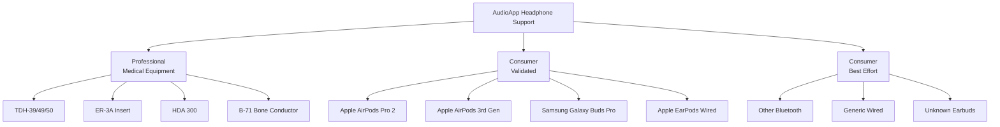
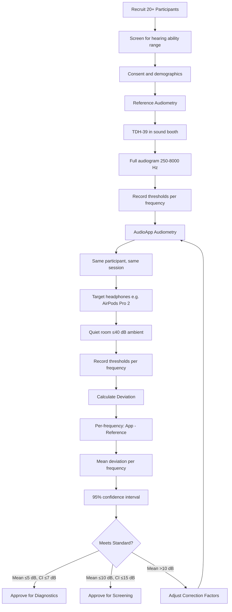

# Headphone Calibration Strategy for AudioApp

**Date:** January 15, 2026  
**Purpose:** Comprehensive calibration approach for professional and consumer headphones to achieve clinical-grade audiometry accuracy

---

## 1. The Calibration Challenge

### Why Calibration Matters

In audiometry, we measure hearing in **dB HL (Hearing Level)**, where 0 dB HL = normal hearing threshold. However, headphones output **dB SPL (Sound Pressure Level)**. The relationship between these varies by:

- **Frequency** (low frequencies need more SPL to sound equally loud)
- **Headphone model** (different drivers, different responses)
- **Coupling** (how headphones sit on/in the ear)

**RETSPL (Reference Equivalent Threshold Sound Pressure Level)** is the bridge:
> *"At frequency X, how many dB SPL equals 0 dB HL?"*

---

## 2. Supported Headphone Categories



---

## 3. Professional Audiometric Equipment

### 3.1 TDH-39/49/50 Supra-aural Headphones

**Description:** Standard clinical headphones used with professional audiometers.

| Frequency (Hz) | RETSPL (dB SPL) | Max Output (dB HL) | Notes |
|---------------|-----------------|-------------------|-------|
| 125 | 45.5 | 100 | Low frequency |
| 250 | 27.0 | 110 | Low frequency |
| 500 | 13.5 | 120 | Speech frequency |
| 750 | 9.0 | 120 | Speech frequency |
| 1000 | 7.5 | 120 | Reference frequency |
| 1500 | 7.5 | 120 | |
| 2000 | 9.0 | 120 | Speech frequency |
| 3000 | 11.5 | 120 | |
| 4000 | 12.0 | 120 | High frequency |
| 6000 | 16.0 | 115 | High frequency |
| 8000 | 15.5 | 100 | High frequency |

**Calibration Status:** ✅ Already implemented in `calibration_constants.dart`

---

### 3.2 ER-3A Insert Earphones

**Description:** Clinical insert earphones with better ambient noise isolation.

| Frequency (Hz) | RETSPL (dB SPL) | Advantage |
|---------------|-----------------|-----------|
| 125 | 26.0 | Lower RETSPL than TDH-39 |
| 250 | 14.0 | Better isolation |
| 500 | 5.5 | |
| 750 | 2.0 | |
| 1000 | 0.0 | Reference = 0 |
| 1500 | 2.0 | |
| 2000 | 3.0 | |
| 3000 | 3.5 | |
| 4000 | 5.5 | |
| 6000 | 2.0 | |
| 8000 | 0.0 | |

**Calibration Status:** ✅ Already implemented

---

### 3.3 HDA 300 Circum-aural Headphones

**Description:** Extended high-frequency testing headphones.

| Frequency (Hz) | RETSPL (dB SPL) |
|---------------|-----------------|
| 125 | 30.5 |
| 250 | 18.0 |
| 500 | 11.0 |
| 1000 | 5.5 |
| 2000 | 4.5 |
| 4000 | 9.5 |
| 8000 | 17.5 |
| 10000 | 22.0 |
| 12500 | 28.0 |
| 16000 | 43.5 |

**Calibration Status:** ✅ Already implemented

---

### 3.4 Radioear B-71 Bone Conductor

**Description:** For bone conduction testing to differentiate conductive vs. sensorineural hearing loss.

**Mastoid Placement RETFL:**
| Frequency (Hz) | RETFL (dB re 1 µN) |
|---------------|-------------------|
| 250 | 67.0 |
| 500 | 58.0 |
| 1000 | 42.5 |
| 2000 | 31.0 |
| 4000 | 35.5 |

**Calibration Status:** ✅ Already implemented

---

## 4. Consumer Headphones - Validated Profiles

### 4.1 Apple AirPods Pro 2

**Target Accuracy:** ±5 dB (clinical-grade with validation)

| Frequency (Hz) | Estimated RETSPL | Correction Factor | Validation Status |
|---------------|-----------------|-------------------|-------------------|
| 250 | ~32.0 | -5.0 | 🔴 Needs validation |
| 500 | ~16.5 | -3.0 | 🔴 Needs validation |
| 1000 | ~7.5 | 0.0 | 🔴 Needs validation |
| 2000 | ~11.0 | -2.0 | 🔴 Needs validation |
| 4000 | ~16.0 | -4.0 | 🔴 Needs validation |
| 8000 | ~21.5 | -6.0 | 🔴 Needs validation |

**Validation Required:**
- [ ] Test 20+ participants with known audiograms
- [ ] Compare against TDH-39 reference in sound booth
- [ ] Calculate mean deviation per frequency
- [ ] Document confidence intervals

---

### 4.2 Apple AirPods (3rd Generation)

**Target Accuracy:** ±7 dB (screening acceptable)

| Frequency (Hz) | Estimated RETSPL | Correction Factor | Validation Status |
|---------------|-----------------|-------------------|-------------------|
| 250 | ~30.0 | -3.0 | 🔴 Needs validation |
| 500 | ~15.0 | -1.5 | 🔴 Needs validation |
| 1000 | ~8.0 | +0.5 | 🔴 Needs validation |
| 2000 | ~12.0 | +3.0 | 🔴 Needs validation |
| 4000 | ~18.0 | +6.0 | 🔴 Needs validation |
| 8000 | ~24.0 | +8.5 | 🔴 Needs validation |

---

### 4.3 Samsung Galaxy Buds Pro

**Target Accuracy:** ±7 dB (screening acceptable)

| Frequency (Hz) | Estimated RETSPL | Correction Factor | Validation Status |
|---------------|-----------------|-------------------|-------------------|
| 250 | ~28.0 | -1.0 | 🔴 Needs validation |
| 500 | ~14.5 | -1.0 | 🔴 Needs validation |
| 1000 | ~8.0 | +0.5 | 🔴 Needs validation |
| 2000 | ~10.5 | +1.5 | 🔴 Needs validation |
| 4000 | ~15.0 | +3.0 | 🔴 Needs validation |
| 8000 | ~20.0 | +4.5 | 🔴 Needs validation |

---

### 4.4 Apple EarPods (Wired 3.5mm/Lightning)

**Target Accuracy:** ±10 dB (screening only)

| Frequency (Hz) | Estimated RETSPL | Correction Factor | Validation Status |
|---------------|-----------------|-------------------|-------------------|
| 250 | ~35.0 | +8.0 | 🔴 Needs validation |
| 500 | ~20.0 | +6.5 | 🔴 Needs validation |
| 1000 | ~10.0 | +2.5 | 🔴 Needs validation |
| 2000 | ~12.0 | +3.0 | 🔴 Needs validation |
| 4000 | ~16.0 | +4.0 | 🔴 Needs validation |
| 8000 | ~22.0 | +6.5 | 🔴 Needs validation |

---

### 4.5 Generic Wired Earbuds (Baseline)

**Target Accuracy:** ±15 dB (warning displayed, screening only)

| Frequency (Hz) | Baseline RETSPL | Uncertainty | Notes |
|---------------|-----------------|-------------|-------|
| 250 | ~40.0 | ±10 dB | High variability |
| 500 | ~22.0 | ±8 dB | |
| 1000 | ~12.0 | ±5 dB | Reference point |
| 2000 | ~14.0 | ±6 dB | |
| 4000 | ~20.0 | ±8 dB | |
| 8000 | ~28.0 | ±12 dB | High variability |

---

## 5. Accuracy Standards

### 5.1 Accuracy Targets by Use Case

| Use Case | Target Deviation | Acceptable Headphones |
|----------|-----------------|----------------------|
| **Clinical Diagnostics** | ±5 dB | Professional (TDH-39, ER-3A, HDA 300) |
| **Validated Consumer** | ±7 dB | AirPods Pro 2, Galaxy Buds Pro (after validation) |
| **Consumer Screening** | ±10 dB | AirPods, EarPods, Samsung Buds |
| **General Screening** | ±15 dB | Generic wired, unknown models |

### 5.2 Industry Standards Reference

| Standard | Requirement |
|----------|-------------|
| **ANSI S3.6** | Audiometer output within ±3 dB of reference |
| **ISO 8253-1** | Test-retest reliability ±5 dB |
| **Clinical Validation** | 95% of thresholds within ±5 dB |
| **Mobile Screening Acceptable** | RMSD ≤ 10 dB |

---

## 6. Calibration Validation Protocol

### 6.1 Equipment Needed

```
For Each Headphone Model Validation:
├── Reference Audiometer (calibrated to ANSI S3.6)
│   └── e.g., GSI AudioStar Pro, Interacoustics AD629
├── Sound-treated Booth (≤35 dB ambient)
├── Artificial Ear / Occluded Ear Simulator
│   └── e.g., GRAS 43AG, B&K 4153
├── Sound Level Meter (Class 1)
├── Acoustic Coupler (2cc for inserts, 6cc for over-ear)
└── Test Device with AudioApp
```

### 6.2 Participant Study Protocol



### 6.3 Statistical Analysis

For each headphone model, calculate:

1. **Mean Deviation per Frequency**
   ```
   Mean_f = Σ(App_threshold - Reference_threshold) / N
   ```

2. **Standard Deviation**
   ```
   SD_f = √[Σ(deviation - mean)² / (N-1)]
   ```

3. **Root Mean Square Deviation**
   ```
   RMSD = √[Σ(deviation²) / N]
   ```

4. **95% Confidence Interval**
   ```
   CI = Mean ± (1.96 × SD / √N)
   ```

**Acceptance Criteria:**
- Diagnostic use: RMSD ≤ 5 dB, 95% CI within ±7 dB
- Screening use: RMSD ≤ 10 dB, 95% CI within ±15 dB

---

## 7. Calibration Maintenance

### 7.1 Calibration Schedule

| Check Type | Frequency | Method | Action if Failed |
|------------|-----------|--------|------------------|
| **Biological** | Daily | Test person with known thresholds | Recalibrate if >10 dB deviation |
| **Listening** | Daily | Audiologist listens to test tones | Check connections, retry |
| **Electroacoustic** | Annual | Professional calibration lab | Full recalibration required |
| **Headphone Wear** | 500 hours use | Visual + acoustic check | Replace transducers |

### 7.2 In-App Calibration Verification

```dart
class CalibrationVerification {
  /// Daily listening check - audiologist confirms tones sound correct
  Future<bool> performListeningCheck();
  
  /// Biological check - test person with known hearing
  Future<CalibrationStatus> performBiologicalCheck({
    required List<int> expectedThresholds,
    required int maxDeviation, // typically 10 dB
  });
  
  /// Record calibration check results
  Future<void> logCalibrationCheck(CalibrationCheckResult result);
  
  /// Get calibration status for headphones
  CalibrationStatus getHeadphoneCalibrationStatus(String headphoneModel);
}
```

---

## 8. Implementation Specifications

### 8.1 Data Model Updates

```dart
/// Headphone calibration profile
class HeadphoneProfile {
  final String id;
  final String brand;            // "Apple", "Samsung"
  final String model;            // "AirPods Pro 2"
  final HeadphoneType type;      // professional, validated, generic
  final Map<int, double> retspl; // Frequency -> dB SPL for 0 dB HL
  final Map<int, double> corrections; // Frequency -> correction factor
  final bool isValidated;        // Has been through validation study
  final DateTime? validationDate;
  final double? validationAccuracy; // RMSD from validation
  final int? participantCount;   // N in validation study
  final ApprovedUsage approvedUsage; // diagnostic, screening, screeningWithWarning
}

enum HeadphoneType { professional, validated, generic }
enum ApprovedUsage { diagnostic, screening, screeningWithWarning }

/// Validation study results
class ValidationResult {
  final String headphoneId;
  final String referenceAudiometer;
  final int participantCount;
  final Map<int, FrequencyDeviation> frequencyDeviations;
  final double overallRMSD;
  final bool meetsDiagnosticStandard;
  final bool meetsScreeningStandard;
  final DateTime validationDate;
  final String validatorName;
}

class FrequencyDeviation {
  final int frequency;
  final double meanDeviation;
  final double standardDeviation;
  final double ci95Lower;
  final double ci95Upper;
}
```

### 8.2 Headphone Detection Flow

```dart
class HeadphoneDetectionService {
  /// Detect connected audio output device
  Future<AudioDevice?> detectConnectedHeadphones();
  
  /// Match device to calibration profile
  HeadphoneProfile? matchProfile(AudioDevice device);
  
  /// Get appropriate warning/disclaimer for device
  HeadphoneDisclaimer getDisclaimer(HeadphoneProfile? profile);
}

enum HeadphoneDisclaimer {
  none,                    // Professional equipment
  validated,               // "Validated for clinical use"
  screeningOnly,           // "For screening purposes only"
  unvalidatedWarning,      // "Results may be less accurate"
  unknownDeviceWarning,    // "Unknown device - use professional headphones"
}
```

### 8.3 Calibration Application Flow

```dart
/// Apply calibration corrections to raw test thresholds
class CalibrationService {
  /// Get calibrated threshold for display
  int getCalibratedThreshold({
    required int frequency,
    required double rawDbSpl,
    required HeadphoneProfile profile,
  }) {
    final retspl = profile.retspl[frequency] ?? 0;
    final correction = profile.corrections[frequency] ?? 0;
    return (rawDbSpl - retspl + correction).round();
  }
  
  /// Get output SPL for desired dB HL
  double getOutputSpl({
    required int frequency,
    required int desiredDbHl,
    required HeadphoneProfile profile,
  }) {
    final retspl = profile.retspl[frequency] ?? 0;
    final correction = profile.corrections[frequency] ?? 0;
    return desiredDbHl + retspl - correction;
  }
}
```

---

## 9. User Interface Considerations

### 9.1 Headphone Selection Screen

```
┌─────────────────────────────────────┐
│     Select Headphones               │
├─────────────────────────────────────┤
│ ┌─────────────────────────────────┐ │
│ │ 🎧 Apple AirPods Pro 2          │ │
│ │ ✅ Validated | ±5 dB accuracy   │ │
│ │ Suitable for: Diagnostics       │ │
│ └─────────────────────────────────┘ │
│                                     │
│ ┌─────────────────────────────────┐ │
│ │ 🎧 Samsung Galaxy Buds Pro      │ │
│ │ ⚠️ Screening Only | ±10 dB      │ │
│ │ Suitable for: Screening         │ │
│ └─────────────────────────────────┘ │
│                                     │
│ ┌─────────────────────────────────┐ │
│ │ 🎧 Other / Generic              │ │
│ │ ❌ Not validated | Unknown      │ │
│ │ Warning displayed during test   │ │
│ └─────────────────────────────────┘ │
│                                     │
│ ┌─────────────────────────────────┐ │
│ │ 🏥 Professional Equipment       │ │
│ │ ✅ Clinical | ±3 dB accuracy    │ │
│ │ TDH-39, ER-3A, HDA 300         │ │
│ └─────────────────────────────────┘ │
└─────────────────────────────────────┘
```

### 9.2 Warning Displays

**For Unvalidated Headphones:**
```
⚠️ Uncalibrated Headphones Detected

Your headphones (Generic Earbuds) have not been 
validated for audiometric testing.

Results may be less accurate than with validated 
headphones. For clinical purposes, please use 
professional audiometric transducers.

[Continue Anyway] [Select Different Headphones]
```

**For Screening-Only Headphones:**
```
ℹ️ Screening Mode

Your headphones (Apple EarPods) are approved for 
hearing screening but not diagnostic audiometry.

Accuracy: ±10 dB (suitable for pass/fail screening)

For diagnostic testing, please use:
• Apple AirPods Pro 2 (validated)
• Professional audiometric headphones

[Start Screening Test] [Change Headphones]
```

---

## 10. Validation Roadmap

### Phase 1: Professional Equipment (Complete)
- [x] TDH-39/49/50 RETSPL values
- [x] ER-3A insert earphone values
- [x] HDA 300 extended frequency values
- [x] B-71 bone conductor values

### Phase 2: Primary Consumer Validation (Weeks 7-10)
- [ ] Apple AirPods Pro 2 - N=25 validation study
- [ ] Samsung Galaxy Buds Pro - N=20 validation study
- [ ] Apple EarPods (wired) - N=20 validation study

### Phase 3: Secondary Consumer Validation (Weeks 11-14)
- [ ] Apple AirPods 3rd Gen - N=15 validation study
- [ ] Samsung Galaxy Buds 2 - N=15 validation study
- [ ] Sony WH-1000XM5 - N=15 validation study

### Phase 4: Ongoing
- [ ] Add new headphone models based on user requests
- [ ] Annual recalibration validation
- [ ] Community-contributed calibration profiles

---

## 11. Summary

| Headphone Category | Status | Target Accuracy | Use Case |
|--------------------|--------|-----------------|----------|
| TDH-39, ER-3A, HDA 300 | ✅ Ready | ±3-5 dB | Full Diagnostics |
| AirPods Pro 2 | 🔴 Needs Validation | ±5-7 dB | Diagnostics (after validation) |
| Galaxy Buds Pro | 🔴 Needs Validation | ±7-10 dB | Screening + Limited Diagnostics |
| EarPods, Galaxy Buds | 🔴 Needs Validation | ±10-12 dB | Screening Only |
| Generic/Unknown | ⚠️ Baseline Only | ±15+ dB | Screening with Warning |
